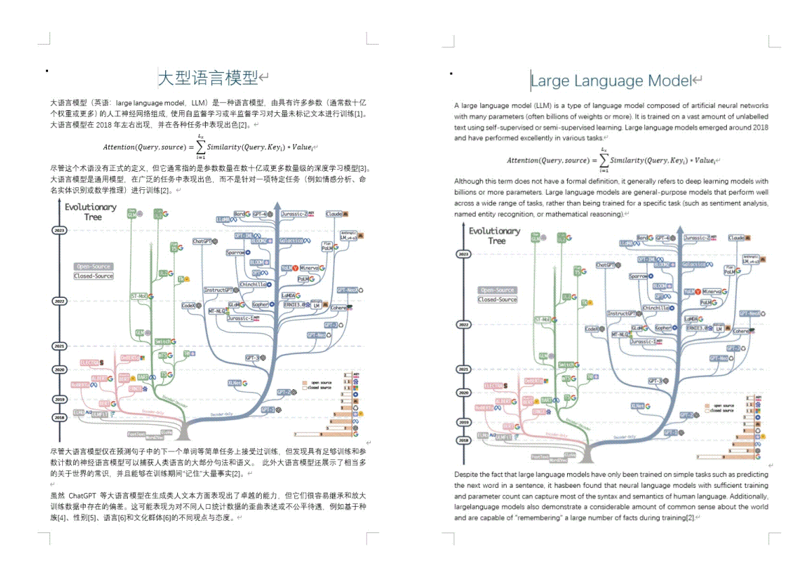

# TransDoc - 智能文档翻译工具 | Intelligent Document Translation Tool

[](LICENSE)
[](https://www.python.org/)
[](https://streamlit.io)
[](https://openai.com/)
[](https://github.com/yourusername/transdoc/issues)

> 本程序由 Windsurf IDE 和 Claude 3.5 Sonnet 模型协助开发完成。This program was developed with the assistance of Windsurf IDE and Claude 3.5 Sonnet model.

[English](#english) | [中文](#chinese)

<div align="center">
  <h1>TransDoc</h1>
  <p>🚀 Powerful AI-Powered Document Translation Tool</p>
</div>

## English

TransDoc is an intelligent document translation tool that leverages AI technology to provide high-quality translations while maintaining document formatting. Built with Streamlit and powered by OpenAI/Azure OpenAI, it offers a user-friendly interface for both document and text translation tasks.



### ✨ Features

- 📄 Comprehensive document format preservation:
  - Images, tables, and mathematical formulas
  - Headings, paragraphs, and text styles
  - Lists and indentation
  - Page layout and spacing
- 🌐 Bilingual user interface (English/Chinese)
- 🤖 AI-powered translation using OpenAI/Azure OpenAI
- 📊 Real-time progress tracking and error handling
- 🔗 URL content translation support
- 💾 Configuration persistence
- 🎨 Clean and intuitive user interface

### 🚀 Quick Start

1. Clone the repository:
```bash
git clone https://github.com/yourusername/transdoc.git
cd transdoc
```

2. Install dependencies:
```bash
pip install -r requirements.txt
```

3. Configure the translator:
```bash
cp translator_config.json.example translator_config.json
# Edit translator_config.json with your API credentials
```

### 💻 Usage

1. Start the application:
```bash
streamlit run app.py
```

2. Select your preferred interface language
3. Upload your document or input text
4. Configure translation settings
5. Start translation

### 🔧 Direct Translation API Usage

You can also use the translation functionality directly in your Python code using `translate.py`:

```python
# Translate text using OpenAI
from translate import translate_oai

translated_text = translate_oai("Hello, world", "Chinese")
print(translated_text)  # Output: 你好，世界

# Translate text using Azure OpenAI
from translate import translate_aoai

translated_text = translate_aoai("Hello, world", "Chinese")
print(translated_text)  # Output: 你好，世界

# Translate Word documents
from translate import translate_file

# Translate a document
output_path = translate_file(
    input_file="input.docx",
    output_file="output.docx",
    target_language="Chinese"
)
```

Key features of direct API usage:
- 🔄 Simple text translation
- 📄 Word document translation with format preservation
- ⚙️ Support for both OpenAI and Azure OpenAI services
- 🔧 Customizable translation settings
- 🛠️ Extensible translator classes for custom implementations

### ⚙️ Configuration

Edit `translator_config.json` to customize:
- API credentials
- Translation settings
- Language pairs

### 📦 Requirements

- Python 3.10+
- Streamlit 1.28+
- OpenAI/Azure OpenAI API access
- See `requirements.txt` for full dependencies

### 🤝 Contributing

Contributions are welcome! Please feel free to submit a Pull Request. For major changes, please open an issue first to discuss what you would like to change.

### 📄 License

This project is licensed under the MIT License - see the [LICENSE](LICENSE) file for details.

## 参考文档 | Reference Documents

在 `docs` 目录下包含了示例文档及其翻译：
The `docs` directory contains example documents and their translations:

- `大模型简介.docx`: 原始中文文档 (Original Chinese document)
- `translated_大模型简介.docx`: 翻译后的英文文档 (Translated English document)

这些文档可以作为翻译质量和格式的参考。
These documents can be used as references for translation quality and formatting.

## Chinese

TransDoc 是一个智能文档翻译工具，利用 AI 技术提供高质量的翻译，同时保持文档格式。基于 Streamlit 构建并由 OpenAI/Azure OpenAI 提供支持，为文档和文本翻译任务提供用户友好的界面。


### ✨ 功能特点

- 📄 完整保留文档原有格式：
  - 图片、表格和数学公式
  - 标题、段落和文本样式
  - 列表和缩进
  - 页面布局和间距
- 🌐 双语用户界面（英文/中文）
- 🤖 基于 OpenAI/Azure OpenAI 的 AI 翻译
- 📊 实时翻译进度跟踪和错误处理
- 🔗 支持 URL 内容翻译
- 💾 配置持久化
- 🎨 清晰直观的用户界面

### 🚀 快速开始

1. 克隆仓库：
```bash
git clone https://github.com/yourusername/transdoc.git
cd transdoc
```

2. 安装依赖：
```bash
pip install -r requirements.txt
```

3. 配置翻译器：
```bash
cp translator_config.json.example translator_config.json
# 编辑 translator_config.json 添加您的 API 凭证
```

### 💻 使用方法

1. 启动应用：
```bash
streamlit run app.py
```

2. 选择界面语言
3. 上传文档或输入文本
4. 配置翻译设置
5. 开始翻译

### 🔧 直接使用翻译 API

您也可以直接在 Python 代码中使用 `translate.py` 进行翻译：

```python
# 使用 OpenAI 进行文本翻译
from translate import translate_oai

translated_text = translate_oai("你好，世界", "English")
print(translated_text)  # 输出：Hello, world

# 使用 Azure OpenAI 进行文本翻译
from translate import translate_aoai

translated_text = translate_aoai("你好，世界", "English")
print(translated_text)  # 输出：Hello, world

# 翻译 Word 文档
from translate import translate_file

# 翻译文档
output_path = translate_file(
    input_file="input.docx",
    output_file="output.docx",
    target_language="English"
)
```

直接 API 使用的关键特点：
- 🔄 简单文本翻译
- 📄 Word 文档翻译并保持格式
- ⚙️ 支持 OpenAI 和 Azure OpenAI 服务
- 🔧 可自定义翻译设置
- 🛠️ 可扩展的翻译器类用于自定义实现

### ⚙️ 配置

编辑 `translator_config.json` 以自定义：
- API 凭证
- 翻译设置
- 语言对

### 📦 环境要求

- Python 3.10+
- Streamlit 1.28+
- OpenAI/Azure OpenAI API 访问权限
- 完整依赖请查看 `requirements.txt`

### 🤝 贡献

欢迎贡献！请随时提交 Pull Request。如需重大更改，请先开 issue 讨论您想要改变的内容。

### 📄 许可证

本项目采用 MIT 许可证 - 详见 [LICENSE](LICENSE) 文件。
